# Лабораторная работа №9

## Задание 0. Подготовительный этап: создание проекта и первого коммита

1. Создайте директорию с именем в формате `фамилия_инициалы_deploy` и перейдите в неё.   
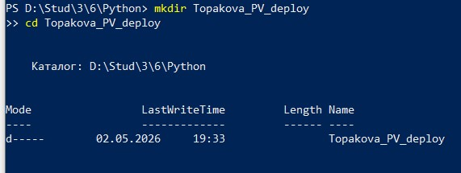   
2. Инициализируйте git-репозиторий.   
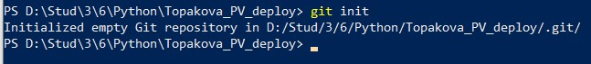   
3. Добавьте файл `.gitignore` с шаблоном для Python.   
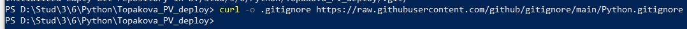   
4. Выполните `uv init`.   
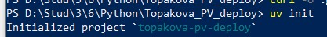   
5. Установите зависимости:
   - Создайте виртуальное окружение: `uv venv`
   - Активируйте его (команда зависит от ОС).
   - Добавьте основные пакеты: `fastapi`, `uvicorn`, `pydantic-settings`.
   - Добавьте пакеты для разработки: `pytest`, `httpx`, `pytest-asyncio`.
   
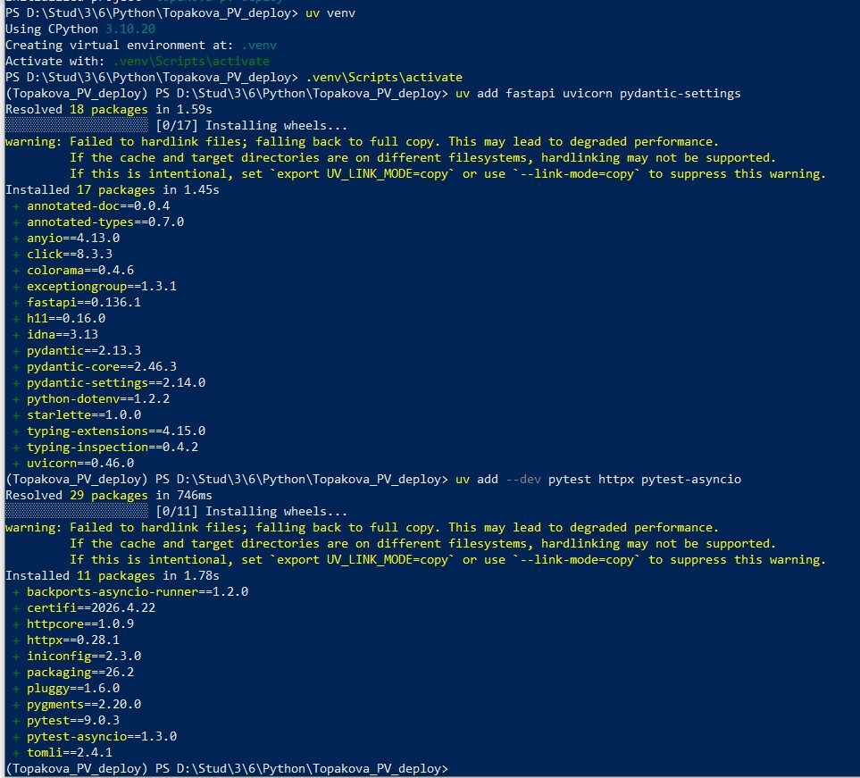   
6. Создайте структуру каталогов   
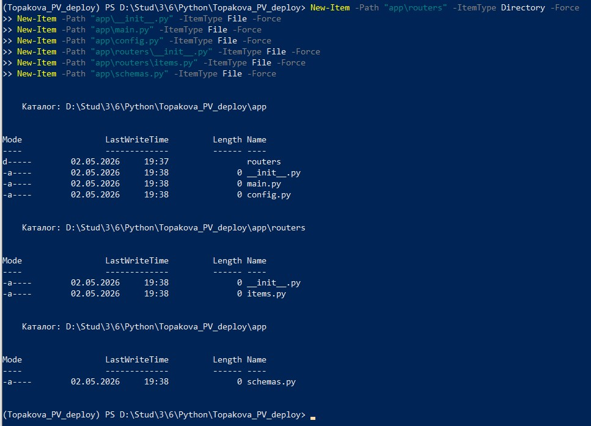   
7. В файле `app/config.py` опишите класс `Settings`, наследующийся от `BaseSettings`, с полями `app_name` (значение по умолчанию `"Test & Deploy Lab"`) и `environment` (по умолчанию `"development"`).   
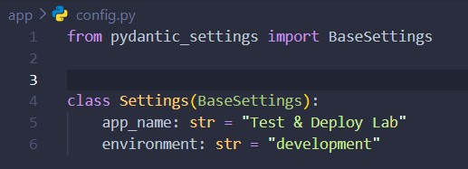   
8. В файле `app/main.py` создайте минимальное FastAPI-приложение:
   - Импортируйте `FastAPI` и класс `Settings`.
   - Создайте экземпляр `Settings`.
   - Создайте экземпляр `FastAPI` с заголовком из настроек.
   - Добавьте корневой эндпоинт, возвращающий приветственное сообщение.   
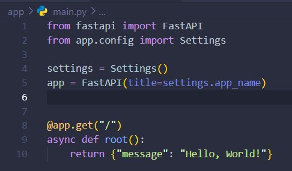   
9. Проверьте работу локальным запуском: `uvicorn app.main:app --reload`.   
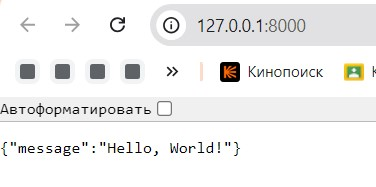   
10. Сделайте коммит, включив в него файлы: `.gitignore`, `pyproject.toml`, `uv.lock`, `.python-version` и каталог `app`. Сообщение коммита: `"init: базовое FastAPI приложение"`.   
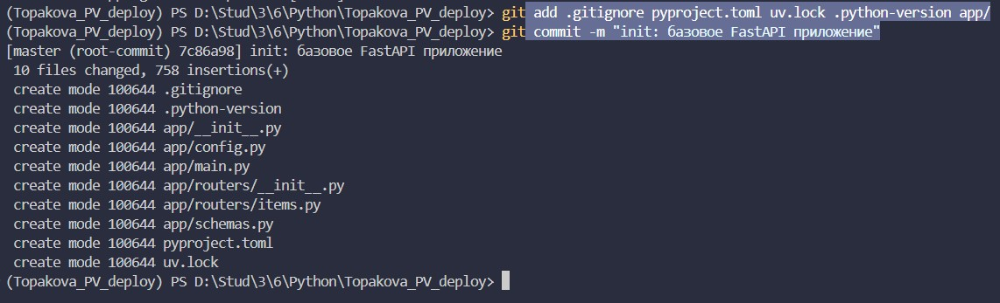   

## Задание 1. Тестирование с pytest

**Цель:** Написать тесты для существующих и новых эндпоинтов с использованием `TestClient`, переопределения зависимостей и проверки ошибок.

1. Реализуйте простой CRUD для товаров:
   - В `app/schemas.py` опишите Pydantic-модели: `ItemCreate` (с полями `name: str` и `price: float`) и `Item`, наследующуюся от `ItemCreate` и добавляющую поле `id: int`.
   - В `app/routers/items.py`:
     - Создайте роутер с префиксом `/items`.
     - Организуйте временное хранилище (`fake_db`) и счётчик.
     - Реализуйте POST-эндпоинт для создания товара: принимает `ItemCreate`, генерирует идентификатор, сохраняет и возвращает созданный товар.
     - Реализуйте GET-эндпоинт для получения товара по `item_id`; если товар не найден, возбуждайте `HTTPException` с кодом 404.
   - Подключите роутер в `app/main.py`.   
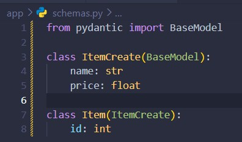      
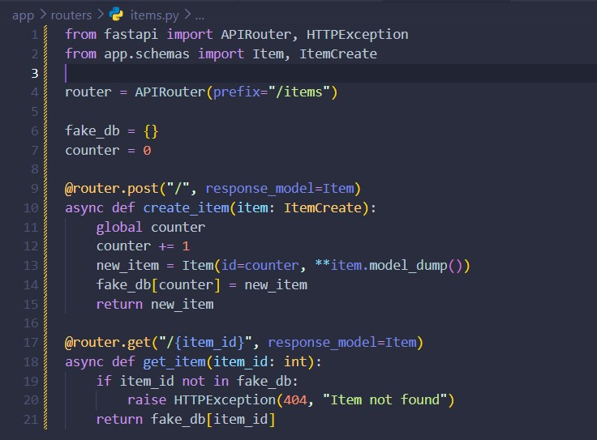      
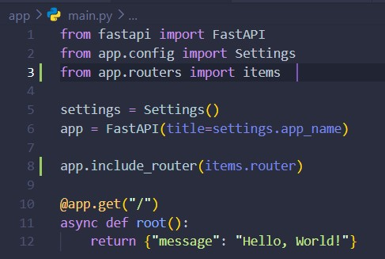   
2. Создайте директорию `tests` и в ней файлы:
   - `conftest.py` с фикстурой клиента `TestClient`, использующей приложение из `app.main`.
   - `test_items.py` с тестовыми функциями.   
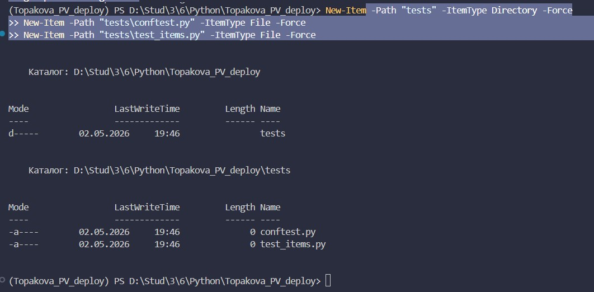   
3. В `conftest.py` опишите фикстуру, возвращающую экземпляр `TestClient`.   
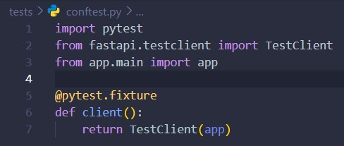   
4. В `test_items.py` напишите тесты:
   - `test_create_item`: отправляет POST-запрос с JSON-данными товара, проверяет код ответа 200, наличие полей `name` и `id` в ответе.
   - `test_get_item_not_found`: отправляет GET-запрос к несуществующему товару, проверяет код 404 и сообщение.   
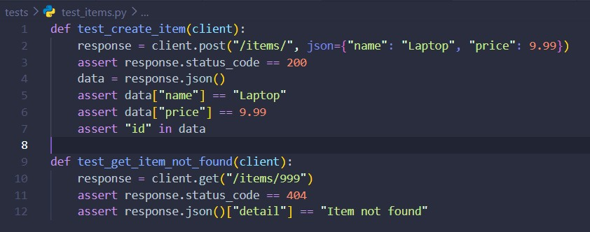   
5. Запустите тесты командой `pytest tests/`.   
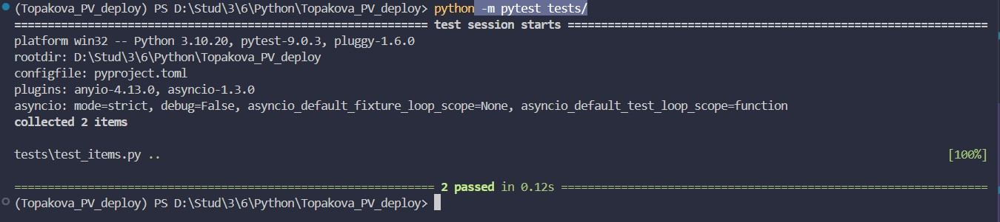   
6. Сделайте коммит с файлами `app/routers/`, `app/schemas.py` и `tests/`. Сообщение: `"feat: добавлены CRUD эндпоинты и тесты pytest"`.   
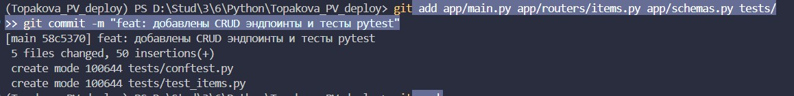   

## Задание 2. Документирование API

**Цель:** Улучшить документацию OpenAPI – добавить описания, теги, примеры, метаданные.

1. В `app/main.py` дополните конструктор `FastAPI`:
   - Укажите `title` из настроек, добавьте `description`, `version` (1.0.0) и `contact`   
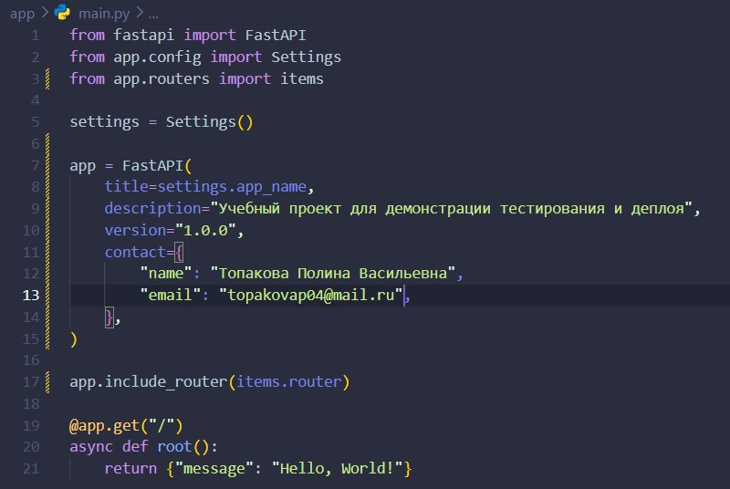   
2. В роутере файла `items.py`:
   - Добавьте к эндпоинтам параметры `summary`, `description`, `response_description`.
   - Для параметра пути `item_id` используйте `Path` с атрибутами `title`, `ge` и примером.
   - Для необязательного query-параметра `q` используйте `Query` с атрибутом `title`.
3. В Pydantic-схемах (`app/schemas.py`) для каждого поля укажите `Field` с `title`, `description` и `example` (или `examples`).
4. Добавьте тег `"items"` к роутеру товаров.
5. Для POST-эндпоинта создания товара пропишите возможный ответ 400 с описанием.   
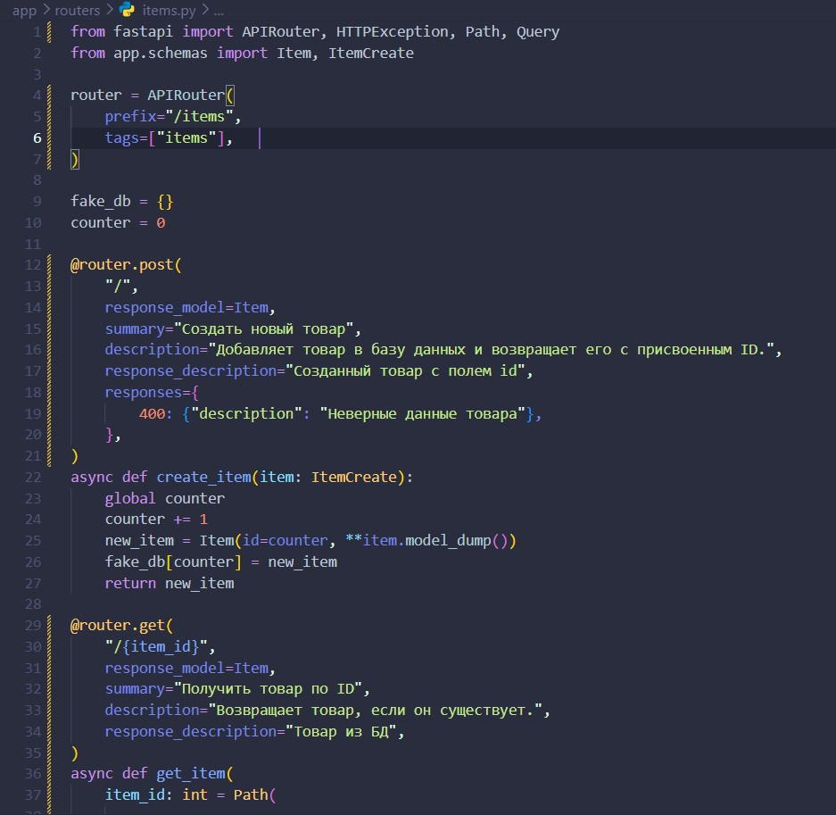   
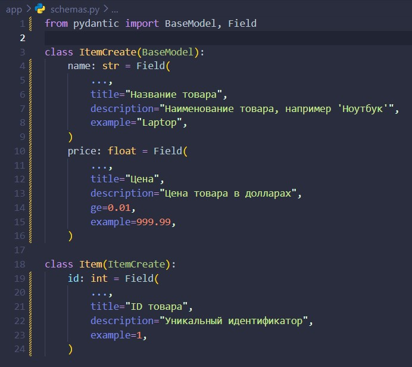   
6. Проверьте результат, открыв `http://localhost:8000/docs`. Все описания должны корректно отображаться.   
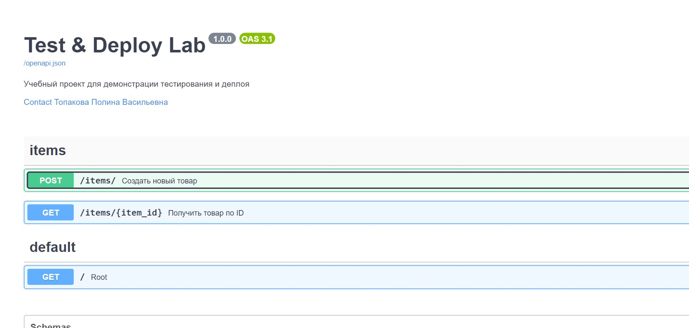   
7. Сделайте коммит, добавив изменённые файлы `app/main.py`, `app/routers/items.py`, `app/schemas.py`. Сообщение: `"docs: улучшена документация OpenAPI"`.   
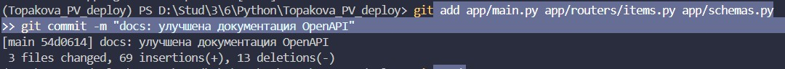   

---

## Задание 3. Подготовка к деплою

**Цель:** Настроить приложение для работы в production-окружении (переменные окружения, запуск через Gunicorn).

1. Дополните `app/config.py`:
   - Добавьте обязательное поле `secret_key`.
   - Добавьте поле `database_url` со значением по умолчанию (SQLite).
   - В `model_config` укажите загрузку переменных из файла `.env`.   
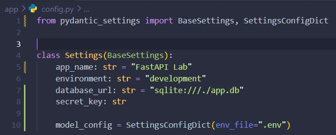   
2. Создайте файл `.env` (его нельзя коммитить!) и задайте в нём значение `SECRET_KEY`.   
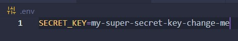   
3. Убедитесь, что в `app/main.py` заголовок приложения и другие настройки берутся из экземпляра `Settings`.   
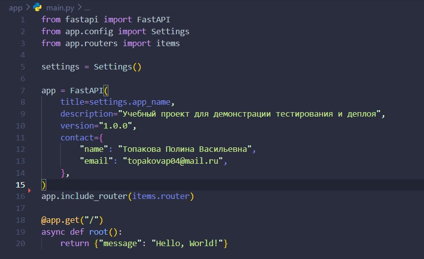   
4. Установите `gunicorn` с помощью `uv add gunicorn`.   
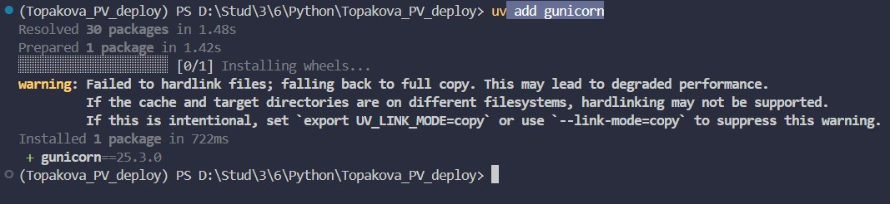   
5. Создайте скрипт `entrypoint.sh`:
   - Укажите shebang `#!/bin/bash`, флаг `set -e`.
   - Запуск gunicorn на приложении `app.main:app` с следующими параметрами:
     - Количество воркеров берётся из переменной окружения `GUNICORN_WORKERS` (по умолчанию 2).
     - Класс воркера: `uvicorn.workers.UvicornWorker`.
     - Привязка к `0.0.0.0` и порту из переменной `PORT` (по умолчанию 8000).
   - Сделайте файл исполняемым (`chmod +x`).   
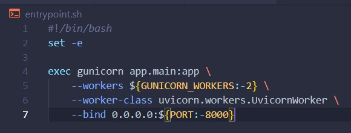   
6. Проверьте локальный запуск (в Unix-подобной среде или WSL): задайте переменные окружения и выполните `./entrypoint.sh`.   
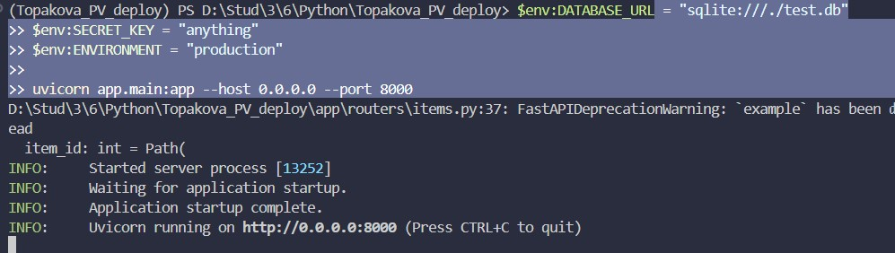   
7. Сделайте коммит с файлами `app/config.py`, `app/main.py` и `entrypoint.sh`. Сообщение: `"build: добавлены production-настройки и gunicorn"`.   
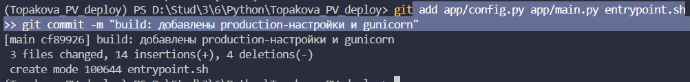   

## Задание 4. Контейнеризация с Docker

**Цель:** Написать Dockerfile и docker-compose.yml для запуска FastAPI-приложения в контейнере.

1. Создайте `Dockerfile` с многостадийной сборкой, использующей `uv`:
   - Стадия `builder`: на основе образа `python:3.12-slim` копируются файлы `pyproject.toml` и `uv.lock`, затем устанавливаются зависимости без dev-пакетов.
   - Финальный образ: на основе `python:3.12-slim` копируется виртуальное окружение из builder, каталог `app`, `entrypoint.sh`; скрипт делается исполняемым. Переменная `PATH` обновляется, открывается порт 8000, команда запуска – `./entrypoint.sh`.
   
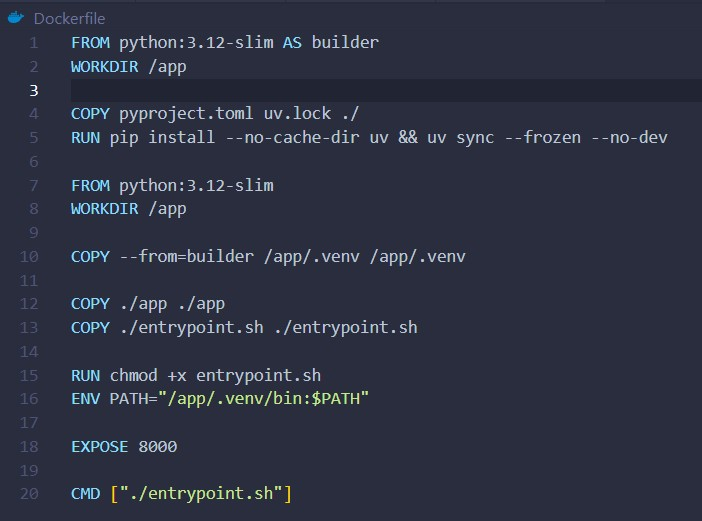   
2. Создайте `.dockerignore`, исключив `.venv`, `.git`, `__pycache__`, `.env` и другие служебные файлы и каталоги.   
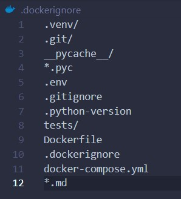   
3. Соберите образ командой `docker build -t fastapi-lab .` и запустите контейнер, передав обязательные переменные (`SECRET_KEY`, `DATABASE_URL`). Проверьте работу приложения.   
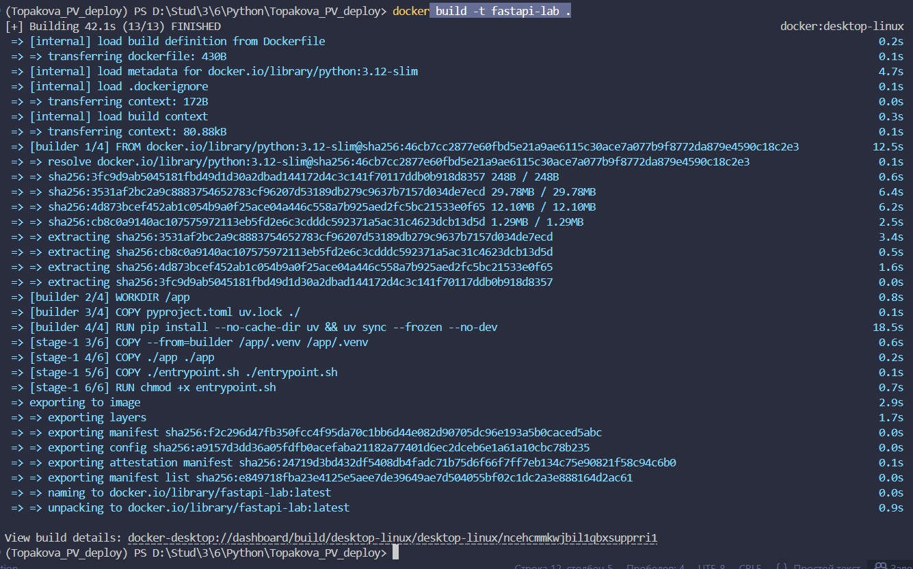      
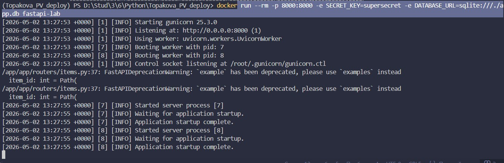      
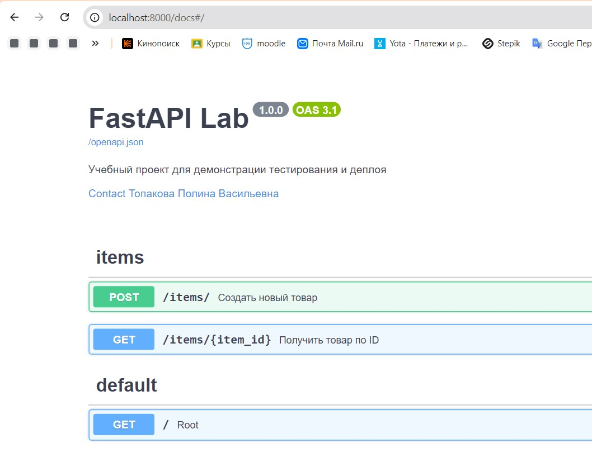   
4. Напишите `docker-compose.yml`:
   - Сервис `db`: образ `postgres:15`, переменные окружения для пользователя, пароля и БД, volume для сохранения данных, healthcheck командой `pg_isready`.
   - Сервис `api`: сборка из текущего контекста, проброс порта 8000, переменные окружения (включая `DATABASE_URL` для подключения к `db` и `SECRET_KEY`), зависимость от `db` с условием `service_healthy`.
   - Объявите том `postgres_data`.   
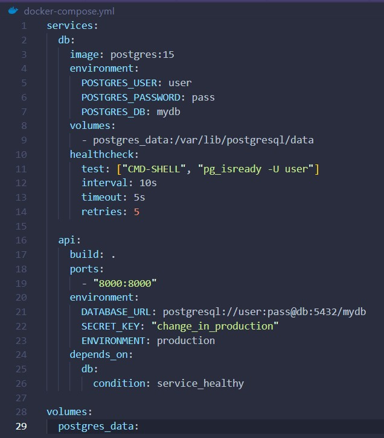   
5. Запустите все сервисы командой `docker compose up --build`.   
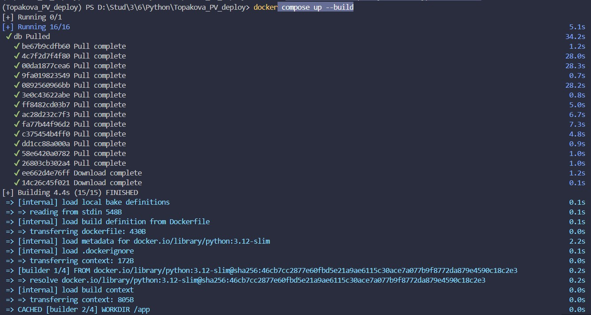      
6. Убедитесь, что API работает на `localhost:8000`.    
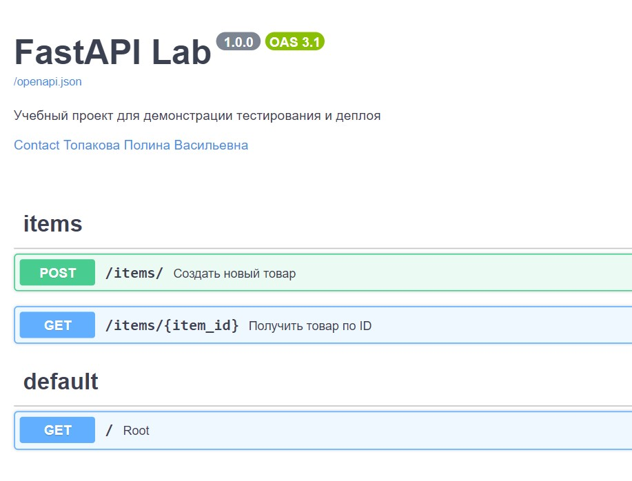      
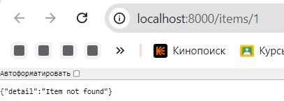   
7. Сделайте коммит с файлами `Dockerfile`, `.dockerignore`, `docker-compose.yml`. Сообщение: `"build: добавлен Docker и docker-compose"`.   
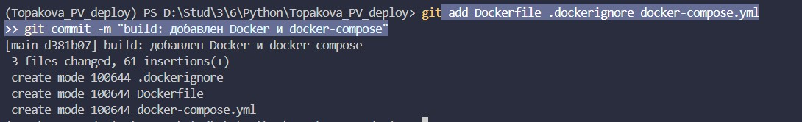   

## Задание 5. Самостоятельная работа

**Важно:** каждый пункт должен быть оформлен отдельным коммитом.

### 1. Healthcheck-эндпоинт

- Добавьте в приложение эндпоинт `/health`, возвращающий статус `{"status": "ok"}`.
- Используйте его в `docker-compose.yml` для проверки готовности сервиса `api` (healthcheck с обращением по `http://localhost:8000/health`). При необходимости доустановите `curl` в образ.
   
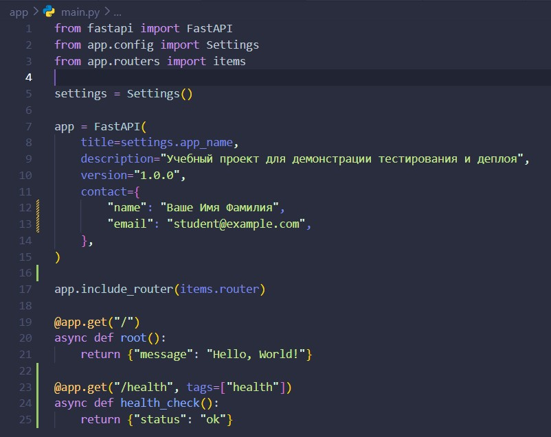      
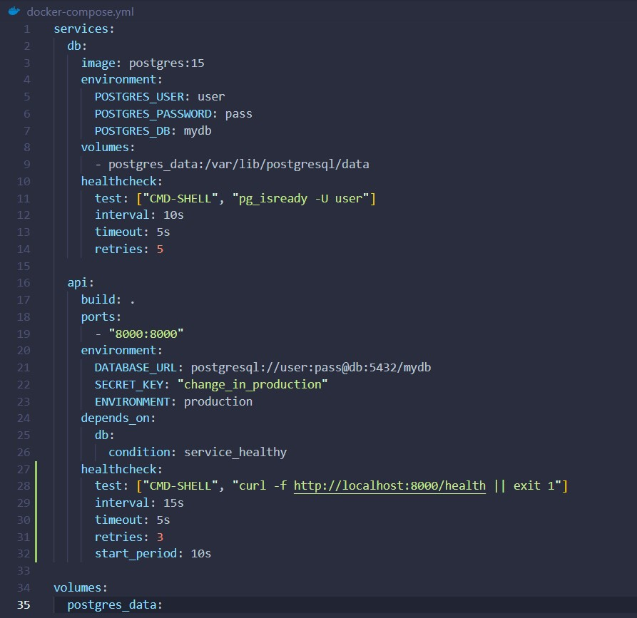      
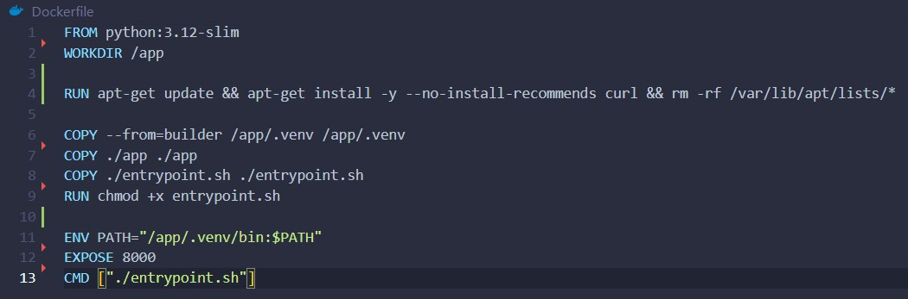      
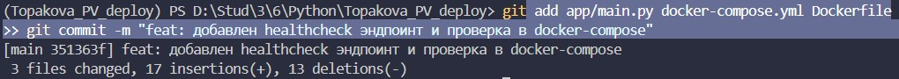      
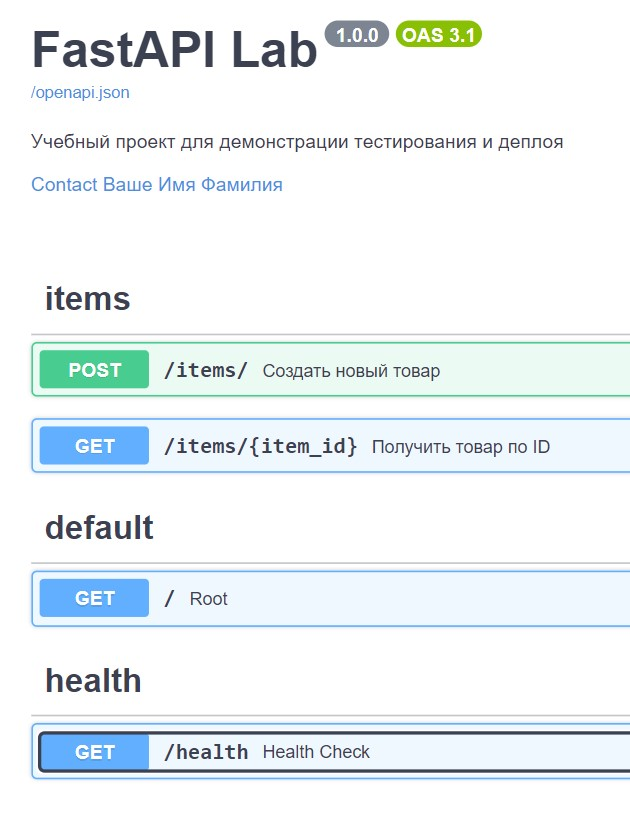      
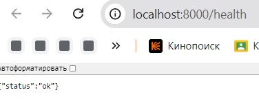   
### 2. Логирование в production

- Настройте структурированное логирование: вывод логов в формате JSON в файл.
  - Создайте модуль с форматтером JSON и функцией инициализации логирования.
  - Внедрите middleware, который будет записывать в лог информацию о каждом запросе (метод, URL, статус, время обработки).
- Файл логов (`app.log`) добавьте в `.gitignore`.    
   
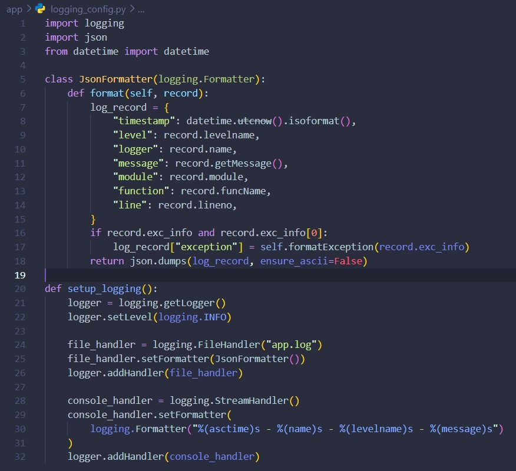      
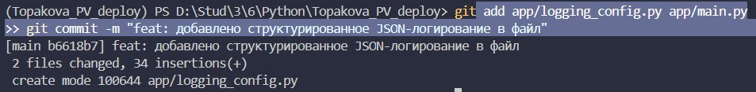      
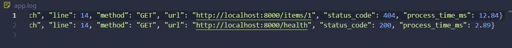      
### 3. Переменное число воркеров Gunicorn

- Скрипт `entrypoint.sh` должен использовать переменную окружения `GUNICORN_WORKERS` для задания количества воркеров (значение по умолчанию — 2).
- Проверьте работу в контейнере: при передаче `GUNICORN_WORKERS=4` должны запускаться четыре воркера.    
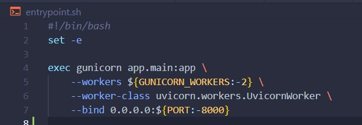       
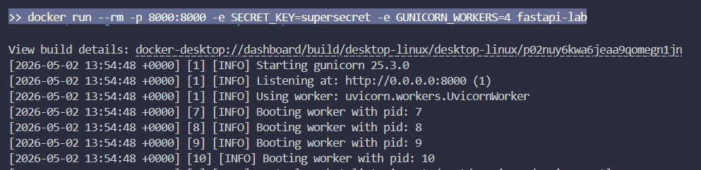      
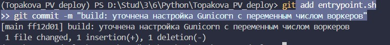      